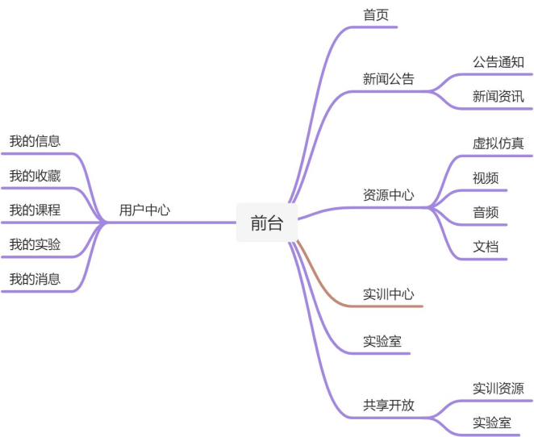
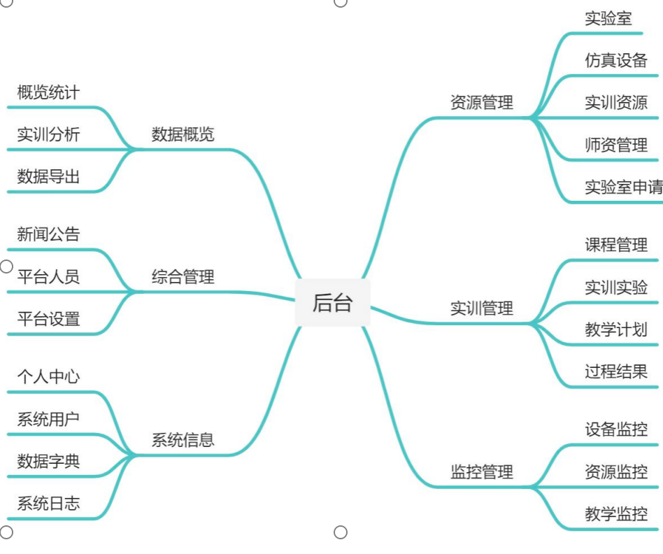

全真项目10 虚拟仿真实训教学管理及资源共享云平台

（1）项目简介
虚拟仿真实训教学管理及资源共享平台用于对虚拟仿真实训教学场所、虚拟仿真实训设施设备和虚拟仿真实训资源进行跨专业、跨院校、跨地域的统筹管理，应具备虚拟仿真实训教学过程的监控分析及虚拟仿真实训资源汇聚分配的管控统计等功能，用于双高院校。

（2）功能需求
虚拟仿真教学管理与资源共享平台门户系统是面向社会人士使用虚拟仿真实验资源的一个入口。功能包括平台首页、新闻公告、资源中心、实训实验、实验室、共享开放、数据大屏展示、数据管理、资源管理、实训管理、综合管理、监控管理、效能管理等。

（3）开发要求
过程规范：CMMI3、RUP；
技术要求：SSM、SpringBoot；
源码管理：Git/SVN配置管理